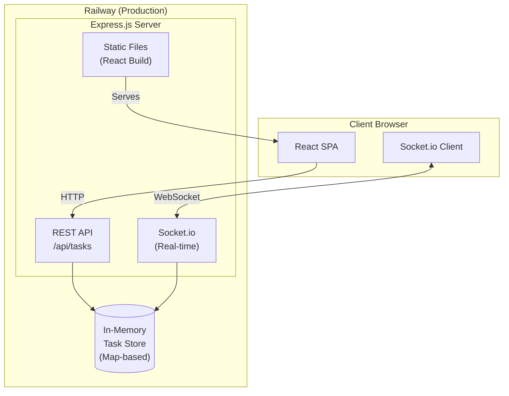
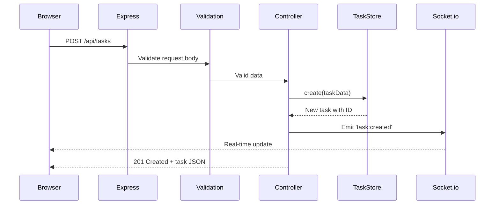
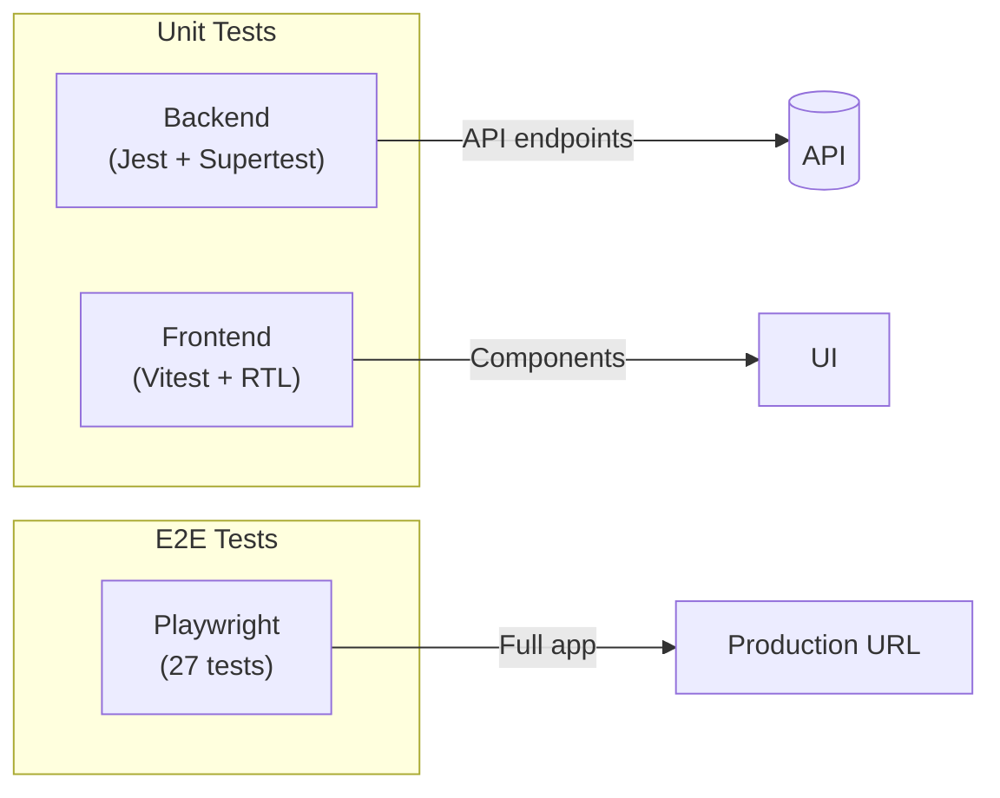
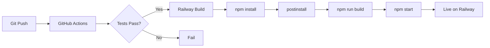
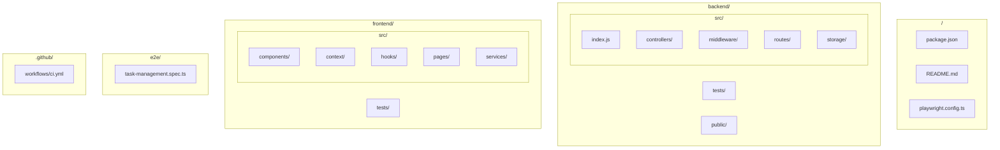

# Task Management Application

A full-stack task management application with a Node.js REST API backend and React frontend dashboard. Create, organize, and track tasks with priorities, statuses, due dates, and tags.

## Live Demo

**[https://task-management-app-production-e866.up.railway.app](https://task-management-app-production-e866.up.railway.app)**

## Architecture Overview



**Frontend:** React SPA served as static files from Express  
**Backend:** Express.js REST API with Socket.io for real-time updates  
**Storage:** In-memory Map (designed for easy database migration)

## Request Flow



## API Documentation

Base URL: `/api`

### Endpoints

| Method | Endpoint | Description |
|--------|----------|-------------|
| GET | `/tasks` | List all tasks (with filtering, sorting, pagination) |
| GET | `/tasks/:id` | Get a single task by ID |
| POST | `/tasks` | Create a new task |
| PUT | `/tasks/:id` | Update an existing task |
| DELETE | `/tasks/:id` | Delete a task |
| GET | `/tasks/stats` | Get task statistics |
| POST | `/tasks/bulk-delete` | Delete multiple tasks |
| PATCH | `/tasks/bulk-status` | Update status for multiple tasks |
| GET | `/tasks/export` | Export tasks as JSON or CSV |

### Query Parameters (GET /tasks)

| Parameter | Type | Description |
|-----------|------|-------------|
| `status` | string | Filter by status: `todo`, `in_progress`, `completed` |
| `priority` | string | Filter by priority: `low`, `medium`, `high` |
| `search` | string | Search in title and description |
| `tags` | string | Comma-separated tags to filter by |
| `dueDateFrom` | ISO date | Filter tasks due after this date |
| `dueDateTo` | ISO date | Filter tasks due before this date |
| `sortBy` | string | Sort field: `createdAt`, `updatedAt`, `dueDate`, `title`, `priority`, `status` |
| `sortOrder` | string | `asc` or `desc` |
| `page` | number | Page number (default: 1) |
| `limit` | number | Items per page (default: 10, max: 100) |

### Task Object

```json
{
  "id": "uuid",
  "title": "string (required, max 100 chars)",
  "description": "string (optional, max 500 chars)",
  "status": "todo | in_progress | completed",
  "priority": "low | medium | high",
  "dueDate": "ISO datetime (optional)",
  "tags": ["string array (optional)"],
  "createdAt": "ISO datetime",
  "updatedAt": "ISO datetime"
}
```

### Example Requests

**Create a task:**
```bash
curl -X POST https://task-management-app-production-e866.up.railway.app/api/tasks \
  -H "Content-Type: application/json" \
  -d '{"title": "My Task", "priority": "high", "status": "todo"}'
```

**Get tasks with filters:**
```bash
curl "https://task-management-app-production-e866.up.railway.app/api/tasks?status=todo&priority=high&sortBy=dueDate&sortOrder=asc"
```

## Tech Stack

### Backend
- **Node.js** (v20+) - Runtime
- **Express.js** - Web framework
- **Socket.io** - Real-time WebSocket communication
- **express-validator** - Input validation
- **morgan** - HTTP request logging
- **cors** - Cross-origin resource sharing
- **uuid** - Unique ID generation

### Frontend
- **React 19** - UI framework
- **Vite** - Build tool
- **Tailwind CSS 4** - Styling
- **Axios** - HTTP client
- **Socket.io-client** - WebSocket client

### Testing
- **Jest** - Backend unit testing
- **Supertest** - HTTP assertions
- **Vitest** - Frontend unit testing
- **React Testing Library** - Component testing
- **Playwright** - End-to-end testing

### DevOps
- **GitHub Actions** - CI/CD pipeline
- **Railway** - Hosting platform
- **ESLint** - Code linting

## Testing

### Test Structure



### Running Tests

```bash
# Run all unit tests
npm test

# Run backend tests only
npm run test:backend

# Run frontend tests only
npm run test:frontend

# Run E2E tests (headless)
npm run test:e2e

# Run E2E tests with UI
npm run test:e2e:ui
```

### E2E Test Demo Mode

Run Playwright tests in a visible browser with adjustable speed:

```bash
# Demo mode with 2 second delay between actions
DEMO=2000 npx playwright test --headed --reporter=list

# Slower demo (3 seconds)
DEMO=3000 npx playwright test --headed --reporter=list

# Run specific test categories
DEMO=2000 npx playwright test --headed --grep "Task Creation"
DEMO=2000 npx playwright test --headed --grep "Task Filtering"
```

**Demo mode features:**
- 🧪 Displays test name before each test runs
- ⏱️ Configurable delay between actions (set via `DEMO` env var in ms)
- ✅ 3-second pause at end of each test to see results
- 🧹 Automatic cleanup of test data after run
- 🖥️ Large viewport (1440x900) for visibility

### E2E Test Coverage

| Category | Tests | Description |
|----------|-------|-------------|
| Page Load & Layout | 4 | Header, stats panel, filters, tasks section |
| Task Creation | 3 | Modal, form submission, validation |
| Task Filtering | 4 | Search, status, priority, reset |
| Task Operations | 2 | Display cards, status change |
| Task Editing | 1 | Edit modal and form |
| Task Deletion | 1 | Delete confirmation |
| Sorting | 2 | Sort field and direction |
| API Health | 3 | Health check, tasks, stats endpoints |
| API CRUD | 3 | Create, read, update, delete cycle |
| Responsive Design | 2 | Mobile (375px), tablet (768px) |
| Export | 2 | JSON and CSV export |
| **Total** | **27** | |

## Local Development

### Prerequisites
- Node.js v20 or higher
- npm

### Setup

1. **Clone the repository:**
   ```bash
   git clone https://github.com/sam-osborne-tech/task-management-app.git
   cd task-management-app
   ```

2. **Install all dependencies:**
   ```bash
   npm run postinstall
   ```

3. **Start the backend (Terminal 1):**
   ```bash
   npm run dev:backend
   ```
   Backend runs at: http://localhost:3001

4. **Start the frontend (Terminal 2):**
   ```bash
   npm run dev:frontend
   ```
   Frontend runs at: http://localhost:5173

### Available Scripts

| Command | Description |
|---------|-------------|
| `npm run dev:backend` | Start backend in development mode |
| `npm run dev:frontend` | Start frontend in development mode |
| `npm run build` | Build frontend and copy to backend/public |
| `npm start` | Start production server |
| `npm test` | Run all unit tests |
| `npm run test:backend` | Run backend tests only |
| `npm run test:frontend` | Run frontend tests only |
| `npm run test:e2e` | Run Playwright E2E tests (headless) |
| `npm run test:e2e:ui` | Run E2E tests with Playwright UI |

## Deployment

### Deployment Flow



### Railway Deployment

The application is deployed on Railway with automatic deploys from the `main` branch.

**How it works:**
1. Push to `main` triggers GitHub Actions CI
2. CI runs tests for backend and frontend
3. Railway detects the push and builds:
   - Runs `npm install` (triggers `postinstall` for subdependencies)
   - Runs `npm run build` (builds frontend, copies to backend/public)
   - Runs `npm start` (starts Express server)
4. Express serves both the API and static frontend files

**Environment:**
- `NODE_ENV=production` - Enables static file serving and optimized CORS
- `PORT` - Automatically set by Railway

### Manual Deployment

```bash
# Build the application
npm run build

# Start production server
NODE_ENV=production npm start
```

## Project Structure



## Assumptions

1. **In-memory storage:** Data persists only for the server session. Server restarts reset all tasks to seed data.

2. **Single-user:** No authentication/authorization. All users share the same task list.

3. **Session-based:** Real-time updates work across browser tabs/windows connected to the same server.

4. **UUID format:** Task IDs must be valid UUIDs for update/delete operations.

5. **Timezone:** All dates are stored and returned in ISO 8601 format (UTC).

## Features

- ✅ Full CRUD operations for tasks
- ✅ Filtering by status, priority, tags, and date range
- ✅ Full-text search across titles and descriptions
- ✅ Sorting by multiple fields
- ✅ Pagination
- ✅ Task statistics dashboard
- ✅ Real-time updates via WebSocket
- ✅ Bulk operations (delete, status update)
- ✅ Export to JSON/CSV
- ✅ Responsive design (mobile + desktop)
- ✅ CI/CD pipeline with GitHub Actions
- ✅ Comprehensive E2E test suite with demo mode

## License

ISC
